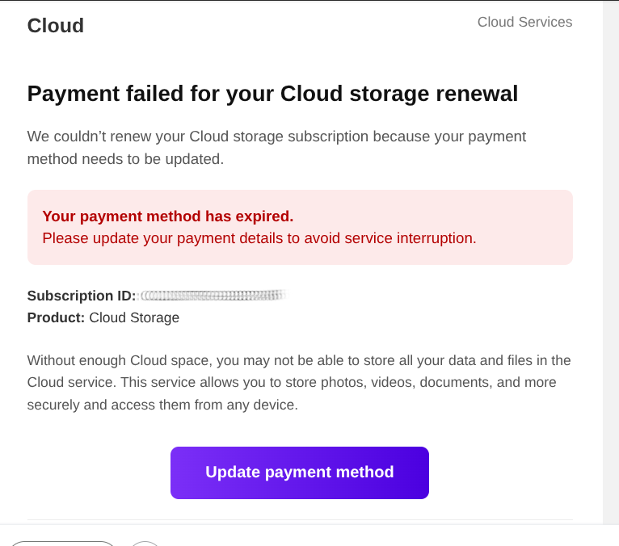
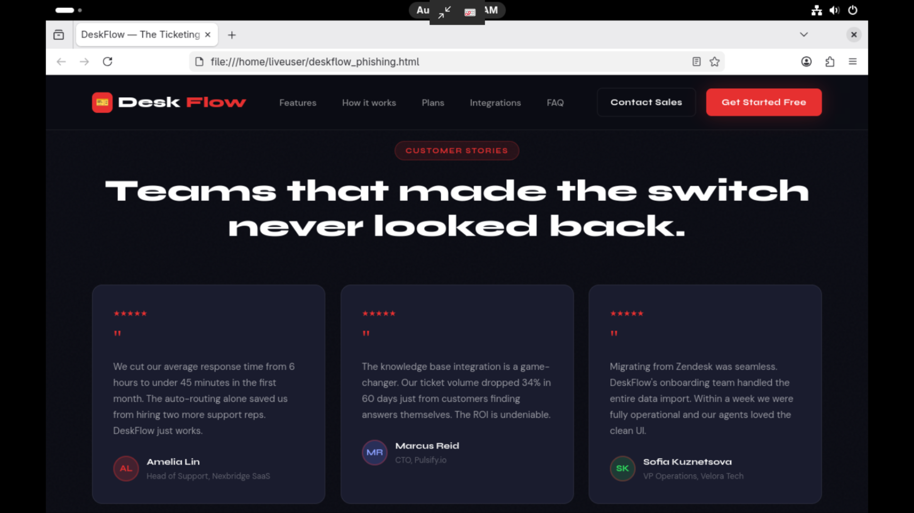

## Bluelight 1

#### Header Layer

Below is an analysis of the email headers. The most pertinent are displayed below in the table:

| Received Date     | Sun, 16 Aug 2026 15:04:54 -0700 (PDT)                                                                |
| ----------------- | ---------------------------------------------------------------------------------------------------- |
| SPF               | google.com: domain of return@sb029.dressfashion.my.id designates ==51.77.30.75== as permitted sender |
| Return Path       | return@sb029.dressfashion.my.id                                                                      |
| Received          | from docs.google.com (dashboard.freedommobile.ca. [==51.77.30.75==])                                 |
| Received          | from efianalytics.com (efianalytics.com. ==216.244.76.116==)                                         |
| Message ID        | <22451-myemail@L58u1UP.qfx>                                                                          |
| X-Original-Sender | <myemail@gmail.com>                                                                                  |
| X-Originating-IP  | ==217.18.210.147==                                                                                   |
| List-Unsubscribe  | <http://L58u1UP.qfx/LEAVE=To>                                                                        |
| Date              | Sun, 16 Aug 2026 21:07:27 +0200                                                                      |
| Subject           | ⛔️ Warning! Your Cloud Storage Is Full                                                               |
| Sender            | myemail@k4nz.sb029.dressfashion.my.id                                                                |


The sender attempted to make the recipient think this was a legitimate Google alert by including X-Headers and stitching the username to the real sender's address. 

#### DNS Layer


| Domain                                                                                                                   | IP                                                    | Notes                                                                                                                                                                                                                           | IP Info                                                                                                                                                                                                                                                                          |
| ------------------------------------------------------------------------------------------------------------------------ | ----------------------------------------------------- | ------------------------------------------------------------------------------------------------------------------------------------------------------------------------------------------------------------------------------- | -------------------------------------------------------------------------------------------------------------------------------------------------------------------------------------------------------------------------------------------------------------------------------- |
| sb029.dressfashion.my.id<br><br>v=spf1 <br>a:api.netresolve.help -all                                                    |                                                       | No A or MX records returned. SPF permits api.netresolve.help as a sender                                                                                                                                                        | "ip": "51.77.30.75",<br>  "hostname": "promos.clarks.com",<br>  "city": "Dunkirk",<br>  "region": "Hauts-de-France",<br>  "country": "FR",<br>  "loc": "51.0344,2.3768",<br>  "org": "AS16276 OVH SAS",<br>  "postal": "59140",<br>  "timezone": "Europe/Paris",<br>             |
| e-presidentielle.<br>lesechos.fr<br>---->CNAME <br>e-presidentielle.<br>webelect.fr<br>---->CNAME<br>api.netresolve.help | 51.77.30.75                                           | Designated sender for sb029.dressfashion.my.id.<br>Reverse lookup matches to the CNAME chain on the left. Example of dangling CNAME attack [[Dangling CNAME Attacks]] <br>                                                      | Shown Above                                                                                                                                                                                                                                                                      |
| efianalytics.com                                                                                                         | ==216.244.76.116 (forged IP) **==  ==132.148.22.170== | Forged record. Reverse lookup for the forged IP leads to 116.wowrack.com, but a forward lookup for wowrack returns a different address. The chain leads down an obfuscation rabbit hole. The second IP is the A record for efi. | "ip": "216.244.76.116",<br>  "hostname": "116.wowrack.com",<br>  "city": "Tukwila",<br>  "region": "Washington",<br>  "country": "US",<br>  "loc": "47.4740,-122.2610",<br>  "org": "AS27323 Wowrack.com",<br>  "postal": "98178",<br>  "timezone": "America/Los_Angeles",<br>   |
| hostingdunyam.com.tr                                                                                                     | ==217.18.210.147==                                    | Likely a forged entry. Maps to a Turkish web hosting provider                                                                                                                                                                   | "ip": "217.18.210.147",<br>  "hostname": "hostingdunyam.com.tr",<br>  "city": "Istanbul",<br>  "region": "Istanbul",<br>  "country": "TR",<br>  "loc": "41.0138,28.9497",<br>  "org": "AS212219 HOSTING DUNYAM",<br>  "postal": "34096",<br>  "timezone": "Europe/Istanbul",<br> |
| k4nz.sb029.<br>dressfashion.my.id                                                                                        |                                                       |                                                                                                                                                                                                                                 | Bombshell finding. See the discussion below                                                                                                                                                                                                                                      |


##### Discussion


I uncovered the sending infrastructure by analyzing k4nz.sb029.dressfashion.my.id. When running a forward lookup, I found a CNAME record pointing to mail_domainkey.sb029.store. Looking at the TXT records, sb029.store authorizes 51.77.30.75 (api.netresolve.help address pool) to send mail on its behalf. 

Whois sb029.store reveals that the domain was registered through NameCheap, Inc. 

Domain Name: sb029.store
Registry Domain ID: DO_8a247c8e815d0090a599b3a39f51c199-RADIX
Registrar WHOIS Server: whois.namecheap.com
Registrar URL: https://www.namecheap.com/
Updated Date: 2026-05-10T18:01:58.425Z
Creation Date: 2026-05-05T18:00:37.163Z
Registry Expiry Date: 2027-05-05T18:00:37.163Z
Registrar: NameCheap, Inc.
Registrar IANA ID: 1068
Registrar Abuse Contact Email: abuse@namecheap.com
Registrar Abuse Contact Phone: +1.9854014545
Domain Status: clientTransferProhibited https://icann.org/epp#clientTransferProhibited
Name Server: dns1.registrar-servers.com
Name Server: dns2.registrar-servers.com
DNSSEC: unsigned
URL of the ICANN RDDS Inaccuracy Complaint Form: https://icann.org/wicf

This is clearly the SPF hub tied to the phishing domains (api.netresolve.help domains and their aliases). Since all phishing emails associated with this operator use the Sb0XX naming convention, exploring the other domains was the next logical step. 


###### Identifying the Pattern


All emails I received from this operator were mailed by an sb0XX domain. When investigating each number in the pool, it became clear that these domains were created programatically, all within 19 seconds of each other on the same date. See below:

sb011.store — 2026-05-05T18:00:19
sb023.store — 2026-05-05T18:00:18
sb027.store — 2026-05-05T18:00:29
sb028.store — 2026-05-05T18:00:36
sb029.store — 2026-05-05T18:00:37

They were also updated 5 days after registration in two distinct batches very close together, likely after configuration of SPF and DKIM records:

sb027.store — 2026-05-10T18:00:58
sb028.store — 2026-05-10T18:01:58
sb029.store — 2026-05-10T18:01:58
sb011.store — 2026-05-10T18:00:58

The update outlier was sb023, which was updated over a month later:

sb023.store — 2026-06-17T16:12:34

A clientHold was also applied to sb023 on the same date, possibly due to abuse reports.

Domain Status: clientHold
Domain Status: clientTransferProhibited

In the email header, the DKIM signature points to the domain d=k4nz.sb029.dressfashion.my.id with a selector s=mail. This corroborates the above. It is also notable that this kit uses RSA sha1, a deprecated algorithm per RFC 8301. 


###### Potential Phishing IP Address Pool

```
api.netresolve.help.	300	IN	A	5.196.246.179
api.netresolve.help.	300	IN	A	5.135.115.7
api.netresolve.help.	300	IN	A	37.59.229.131
api.netresolve.help.	300	IN	A	5.39.1.2
api.netresolve.help.	300	IN	A	185.185.40.6
api.netresolve.help.	300	IN	A	51.68.7.175
api.netresolve.help.	300	IN	A	5.135.14.53
api.netresolve.help.	300	IN	A	5.196.248.32
api.netresolve.help.	300	IN	A	51.178.172.175
api.netresolve.help.	300	IN	A	50.31.235.108
api.netresolve.help.	300	IN	A	5.39.1.0
api.netresolve.help.	300	IN	A	51.38.17.99
api.netresolve.help.	300	IN	A	5.196.131.168
api.netresolve.help.	300	IN	A	51.77.30.75
api.netresolve.help.	300	IN	A	185.185.40.68
api.netresolve.help.	300	IN	A	5.135.108.90
api.netresolve.help.	300	IN	A	5.254.8.100
api.netresolve.help.	300	IN	A	51.178.244.16
api.netresolve.help.	300	IN	A	51.68.252.145
api.netresolve.help.	300	IN	A	37.59.140.157
api.netresolve.help.	300	IN	A	51.68.75.71
api.netresolve.help.	300	IN	A	51.254.7.6
api.netresolve.help.	300	IN	A	51.75.107.86
api.netresolve.help.	300	IN	A	5.135.115.4
api.netresolve.help.	300	IN	A	54.37.46.208
api.netresolve.help.	300	IN	A	5.196.190.81
api.netresolve.help.	300	IN	A	51.68.59.249
api.netresolve.help.	300	IN	A	5.39.1.3
api.netresolve.help.	300	IN	A	82.41.64.196
api.netresolve.help.	300	IN	A	51.68.74.213
api.netresolve.help.	300	IN	A	185.159.108.39
api.netresolve.help.	300	IN	A	51.38.165.152
api.netresolve.help.	300	IN	A	5.135.115.5
api.netresolve.help.	300	IN	A	51.38.217.7
api.netresolve.help.	300	IN	A	5.135.115.6
api.netresolve.help.	300	IN	A	46.105.85.72
api.netresolve.help.	300	IN	A	85.121.126.188
api.netresolve.help.	300	IN	A	185.159.108.46
api.netresolve.help.	300	IN	A	147.135.203.120
api.netresolve.help.	300	IN	A	51.38.1.71
api.netresolve.help.	300	IN	A	85.121.126.182
api.netresolve.help.	300	IN	A	5.39.1.1
api.netresolve.help.	300	IN	A	82.41.64.197
```

###### Subnets


I wrote a script to iterate through the IP pool. Here is the output:

=================================================
promos.clarks.com.
 
5.196.190.81
  "hostname": "promos.clarks.com",
  "region": "Hauts-de-France",
  "org": "AS16276 OVH SAS",
 
******
=================================================
micorazonsano.personal.com.ar.
 
5.254.8.100
  "hostname": "micorazonsano.personal.com.ar",
  "region": "Hesse",
  "org": "AS3223 Voxility LLP",
 
******
=================================================
promos.clarks.com.
 
5.39.1.1
  "hostname": "social.crunch.com",
  "region": "Hauts-de-France",
  "org": "AS16276 OVH SAS",
 
******
=================================================
e-presidentielle.lesechos.fr.
 
5.196.248.32
  "hostname": "promos.clarks.com",
  "region": "Hauts-de-France",
  "org": "AS16276 OVH SAS",
 
******
=================================================
dashboard.freedommobile.ca.
 
85.121.126.182
  "hostname": "promos.clarks.com",
  "region": "South Holland",
  "org": "AS9009 M247 Europe SRL",
 
******
=================================================
www.nosotros.sancristobal.com.ar.
 
185.185.40.6
  "hostname": "www.nosotros.sancristobal.com.ar",
  "region": "North Holland",
  "org": "AS7489 HostUS",
 
******
=================================================
social.crunch.com.
 
185.185.40.68
  "hostname": "social.crunch.com",
  "region": "North Holland",
  "org": "AS7489 HostUS",
 
******
=================================================
dashboard.freedommobile.ca.
 
51.178.172.175
  "hostname": "micorazonsano.personal.com.ar",
  "region": "Hauts-de-France",
  "org": "AS16276 OVH SAS",
 
******
=================================================
dashboard.freedommobile.ca.
 
5.135.115.5
  "hostname": "dr-notifiche.nexin.it",
  "region": "Hauts-de-France",
  "org": "AS16276 OVH SAS",
 
******
=================================================
promos.clarks.com.
 
51.38.165.152
  "hostname": "promos.clarks.com",
  "region": "Grand Est",
  "org": "AS16276 OVH SAS",
 
******
=================================================
e-presidentielle.lesechos.fr.
 
5.39.1.0
  "hostname": "social.crunch.com",
  "region": "Hauts-de-France",
  "org": "AS16276 OVH SAS",
 
******
=================================================
micorazonsano.personal.com.ar.
 
5.135.14.53
  "hostname": "micorazonsano.personal.com.ar",
  "region": "Hauts-de-France",
  "org": "AS16276 OVH SAS",
 
******
=================================================
e-presidentielle.lesechos.fr.
 
51.77.30.75
  "hostname": "promos.clarks.com",
  "region": "Hauts-de-France",
  "org": "AS16276 OVH SAS",
 
******
=================================================
promo.clarks.com.
 
51.38.1.71
  "hostname": "dashboard.freedommobile.ca",
  "region": "Hauts-de-France",
  "org": "AS16276 OVH SAS",
 
******
=================================================
dashboard.freedommobile.ca.
 
85.121.126.188
  "hostname": "promos.clarks.com",
  "region": "South Holland",
  "org": "AS9009 M247 Europe SRL",
 
******
=================================================
dashboard.freedommobile.ca.
 
185.159.108.46
  "hostname": "dashboard.freedommobile.ca",
  "region": "Hesse",
  "org": "AS211428 Keyfinanz Gesellschaft mbH",
 
******
=================================================
e-presidentielle.lesechos.fr.
 
5.39.1.3
  "hostname": "social.crunch.com",
  "region": "Hauts-de-France",
  "org": "AS16276 OVH SAS",
 
******
=================================================
e-presidentielle.lesechos.fr.
 
147.135.203.120
  "hostname": "social.crunch.com",
  "region": "Hauts-de-France",
  "org": "AS16276 OVH SAS",
 
******
=================================================
unknown.servercentral.net.
 
50.31.235.108
  "hostname": "unknown.servercentral.net",
  "region": "North Holland",
  "org": "AS23352 DEFT.COM",
 
******
=================================================
e-presidentielle.lesechos.fr.
 
5.39.1.2
  "hostname": "office2go.vodafone.com",
  "region": "Hauts-de-France",
  "org": "AS16276 OVH SAS",
 
******
=================================================
 
51.178.244.16
  "hostname": "dashboard.freedommobile.ca",
  "region": "Hauts-de-France",
  "org": "AS16276 OVH SAS",
 
******
=================================================
promos.clarks.com.
 
37.59.229.131
  "hostname": "social.crunch.com",
  "region": "Hauts-de-France",
  "org": "AS16276 OVH SAS",
 
******
=================================================
dashboard.freedommobile.ca.
 
82.41.64.196
  "hostname": "dashboard.freedommobile.ca",
  "region": "Hesse",
  "org": "AS215030 Budankailu Namrata Patra trading as AspireHosting",
 
******
=================================================
e-presidentielle.lesechos.fr.
 
51.68.74.213
  "hostname": "promos.clarks.com",
  "region": "Hauts-de-France",
  "org": "AS16276 OVH SAS",
 
******
=================================================
e-presidentielle.lesechos.fr.
 
5.196.246.179
  "hostname": "social.crunch.com",
  "region": "Hauts-de-France",
  "org": "AS16276 OVH SAS",
 
******
=================================================
social.crunch.com.
 
46.105.85.72
  "hostname": "social.crunch.com",
  "region": "Hauts-de-France",
  "org": "AS16276 OVH SAS",
 
******
=================================================
 
51.38.217.7
  "hostname": "promos.clarks.com",
  "region": "Hauts-de-France",
  "org": "AS16276 OVH SAS",
 
******
=================================================
e-presidentielle.lesechos.fr.
 
5.135.115.7
  "hostname": "dr-notifiche.nexin.it",
  "region": "Hauts-de-France",
  "org": "AS16276 OVH SAS",
 
******
=================================================
social.crunch.com.
 
51.68.252.145
  "hostname": "social.crunch.com",
  "region": "Hauts-de-France",
  "org": "AS16276 OVH SAS",
 
******
=================================================
promos.clarks.com.
 
51.68.7.175
  "hostname": "promos.clarks.com",
  "region": "Hauts-de-France",
  "org": "AS16276 OVH SAS",
 
******
=================================================
e-presidentielle.lesechos.fr.
 
5.135.108.90
  "hostname": "promos.clarks.com",
  "region": "Hauts-de-France",
  "org": "AS16276 OVH SAS",
 
******
=================================================
office2go.vodafone.com.
 
5.196.131.168
  "hostname": "office2go.vodafone.com",
  "region": "Hauts-de-France",
  "org": "AS16276 OVH SAS",
 
******
=================================================
dashboard.freedommobile.ca.
 
51.68.59.249
  "hostname": "dashboard.freedommobile.ca",
  "region": "Grand Est",
  "org": "AS16276 OVH SAS",
 
******
=================================================
social.crunch.com.
 
37.59.140.157
  "hostname": "social.crunch.com",
  "region": "Hauts-de-France",
  "org": "AS16276 OVH SAS",
 
******
=================================================
e-presidentielle.lesechos.fr.
 
51.38.17.99
  "region": "Hauts-de-France",
  "org": "AS16276 OVH SAS",
 
******
=================================================
dashboard.freedommobile.ca.
 
82.41.64.197
  "hostname": "dashboard.freedommobile.ca",
  "region": "Hesse",
  "org": "AS215030 Budankailu Namrata Patra trading as AspireHosting",
 
******
=================================================
 
51.75.107.86
  "region": "Hauts-de-France",
  "org": "AS16276 OVH SAS",
 
******
=================================================
e-presidentielle.lesechos.fr.
 
51.254.7.6
  "hostname": "ip6.ip-51-254-7.eu",
  "region": "Hauts-de-France",
  "org": "AS16276 OVH SAS",
 
******
=================================================
e-presidentielle.lesechos.fr.
 
5.135.115.6
  "hostname": "dr-notifiche.nexin.it",
  "region": "Hauts-de-France",
  "org": "AS16276 OVH SAS",
 
******
=================================================
promo.clarks.com.
 
51.68.75.71
  "hostname": "promo.clarks.com",
  "region": "Hauts-de-France",
  "org": "AS16276 OVH SAS",
 
******
=================================================
e-presidentielle.lesechos.fr.
 
54.37.46.208
  "hostname": "cloudflare-test.daily.ai",
  "region": "Hauts-de-France",
  "org": "AS16276 OVH SAS",
 
******
=================================================
dashboard.freedommobile.ca.
 
5.135.115.4
  "hostname": "dr-notifiche.nexin.it",
  "region": "Hauts-de-France",
  "org": "AS16276 OVH SAS",
 
******
=================================================
micorazonsano.personal.com.ar.
 
185.159.108.39
  "hostname": "micorazonsano.personal.com.ar",
  "region": "Hesse",
  "org": "AS211428 Keyfinanz Gesellschaft mbH",


There was an interesting CNAME loop for dr-notifiche.nexin.it, and I'm sure others would return similar findings:


`dr-notifiche.nexin.it`
      `↓ CNAME`
`ispc1.dr.nexin.network`
      `↓ A records`
`5.135.115.4, 5.135.115.5, 5.135.115.6, 5.135.115.7` (Subnet with 4 addresses) 

`Reverse lookup of 5.135.115.4`
      `↓ PTR`
`dashboard.freedommobile.ca`

`Forward lookup of dashboard.freedommobile.ca`
      `↓ CNAME`
`prdntxappl11.sjrb.ad`
      `↓ CNAME`
`api.netresolve.help`
      `↓ A records`
`43 OVH IPs including 5.135.115.4, 5.135.115.5, 5.135.115.6, 5.135.115.7`

```
api.netresolve.help.	300	IN	A	5.135.115.6
api.netresolve.help.	300	IN	A	5.135.115.5
api.netresolve.help.	300	IN	A	5.135.115.4
api.netresolve.help.	300	IN	A	5.135.115.7

api.netresolve.help.	300	IN	A	5.39.1.1
api.netresolve.help.	300	IN	A	5.39.1.3
api.netresolve.help.	300	IN	A	5.39.1.0
api.netresolve.help.	300	IN	A	5.39.1.2
```

Observe the subnets above. After retreiving the hosting information:

As expected, all OVH

=================================================
e-presidentielle.lesechos.fr.
 
5.39.1.0
  "hostname": "social.crunch.com",
  "region": "Hauts-de-France",
  "org": "AS16276 OVH SAS",
 
******
=================================================
promos.clarks.com.
 
5.39.1.1
  "hostname": "social.crunch.com",
  "region": "Hauts-de-France",
  "org": "AS16276 OVH SAS",
 
******
=================================================
e-presidentielle.lesechos.fr.
 
5.39.1.2
  "hostname": "office2go.vodafone.com",
  "region": "Hauts-de-France",
  "org": "AS16276 OVH SAS",
 
******
=================================================
e-presidentielle.lesechos.fr.
 
5.39.1.3
  "hostname": "social.crunch.com",
  "region": "Hauts-de-France",
  "org": "AS16276 OVH SAS",
 
******
=================================================
dashboard.freedommobile.ca.
 
5.135.115.4
  "hostname": "dr-notifiche.nexin.it",
  "region": "Hauts-de-France",
  "org": "AS16276 OVH SAS",
 
******
=================================================
dashboard.freedommobile.ca.
 
5.135.115.5
  "hostname": "dr-notifiche.nexin.it",
  "region": "Hauts-de-France",
  "org": "AS16276 OVH SAS",
 
******
=================================================
e-presidentielle.lesechos.fr.
 
5.135.115.6
  "hostname": "dr-notifiche.nexin.it",
  "region": "Hauts-de-France",
  "org": "AS16276 OVH SAS",
 
******
=================================================
e-presidentielle.lesechos.fr.
 
5.135.115.7
  "hostname": "dr-notifiche.nexin.it",
  "region": "Hauts-de-France",
  "org": "AS16276 OVH SAS",
 
******


#### Lure Layer


Despite the sophisticated obfuscation demonstrated above, the email still landed in the spam folder. This particular email was a fake cloud services email with a mismatched subject line and email body. The subject line claimed my cloud storage was full, but the email body was alerting me to an invalid payment method.


##### The Email Body


The email body contained a message about cloud storage payment method failing and was designed to mimic an email from Google. 





The "Update payment method" button leads to the Google Storage bucket below:

"https://storage.googleapis.com/devilex/devilex1.html#?act=xx&pid=9999_md&uid=9999&vid=999&ofid=999&lid=999&cid=9999" 

The parameters in the URL appear to identify affiliate ID, possible user ID, offer (lure) ID, and campaign ID. 

Note: I have altered the parameters in the URL above to avoid any attribution.


##### Redirect Chain


###### Cloud Lure Page


The button address led to the google storage bucket featuring a Cloudflare Turnstile and messages to the user informing them of a security check and redirect. The page features the below redirect script

`function executeRedirect(token) {`
      `document.getElementById("loading-spinner").style.display = "none";`
      `document.getElementById("success-icon").style.display = "block";`

      document.getElementById("status-title").innerText = "Verification complete";
      document.getElementById("status-desc").innerText = "Connection secure. Redirecting you now...";
      document.getElementById("status-title").style.color = "#10b981";

      const currentHash = window.location.hash;

      setTimeout(() => {
        window.location.href = "http://pociv.site/" + currentHash;
      }, 1000);


This script takes the query parameters from the Google Storage URL and appends them to the tracking URL, pociv.site. 


###### Deskflow and Redirect


A redirect script was found above the HTML document for the redirect page (see below).

```JavaScript
<script>if(window.location.href.includes("#")) window.location.href = window.location.href.replace(/\/\#\//g,'#').replace(/\/\#/g,'#').replace(/\#/g,'/');</script>
```
<!DOCTYPE html>

The html below the redirect script generates a fake SaaS product page, which purports to be selling an all-in-one service desk solution called “DeskFlow”. At first glance, it seemed that the purpose of the page was to harvest business credentials, but the form didn’t appear to be tied to any exfiltration scripts; rather, it simply confirms the user's email and informs them that they will be in contact within 2 business hours.

The page itself is not very convincing. While the colors and styling weren’t bad, there were a number of red flags, including a company logo that appeared simply to be the ticket emoji, all website sections confined to a single page, non-functioning links to various sections (about us, contact us, privacy policy, etc.), and links to socials that simply pointed to the website header.

It isn’t entirely clear why the page exists, given the redirect script at the top and the lack of credential harvesting scripts. Perhaps it serves as a fallback page in case redirection fails, or maybe it is a page that will eventually harvest business credentials. It could also be that the script was removed. The dangling CNAME domains shown here [[Dangling CNAME Attacks]] show that multiple separate addresses all point the user to this page. The important thing to note, however, is that the redirect script above only fires if the user enters the site through the Google buckets.

Below are screenshots of the DeskFlow page. To compile it successfully, I removed the redirect script from the top. It can also be found by following the addresses found in [[Dangling CNAME Attacks]] page.




###### TDS Layer 1


The redirect pointed to bluelightlenzo.com, which appears to be the first layer of a traffic distribution system. The site is hosted by Proen Corp, Bangkok Thailand (103.13.229.212) and appears to set cookies, enrich the victim's tracking profile, and automatically redirect the user to the next node in the redirect chain.

###### TDS Layer 2

The next hop in the campaign was solutionfornow.com (Google LLC, Kansas City USA, 34.54.131.103), which contained another redirect script. This is where the victim’s IP address was logged, a short-lived (1 hour) session cookie set, and enriched parameters are passed to the next hop – no interaction, only an intermediary.

###### Credential Harvester and Payload Server

The final malicious page in the redirect chain led to verify.securedenvironment.com - Cloudflare anycast, real IP hidden (172.67.178.18 + 104.21.17.186). This is where the fully-enriched victim profile is passed and where the final routing decision is likely made. In this case, the final destination was Yahoo, indicating a potentially expired campaign or my VPN exit node being filtered by the TDS. 6-month and 24-hour cookies were set here.


#### Conclusion

This appears to be a coordinated operation with an elaborate infrastructure, including a pool of 43 IP addresses, 2 subnets, and multiple subdomain takeovers. The operator's infrastructure signs and sends the mail and handles the redirect chain, and a TDS routes traffic according to the victim's profile and the affiliate identity. 
