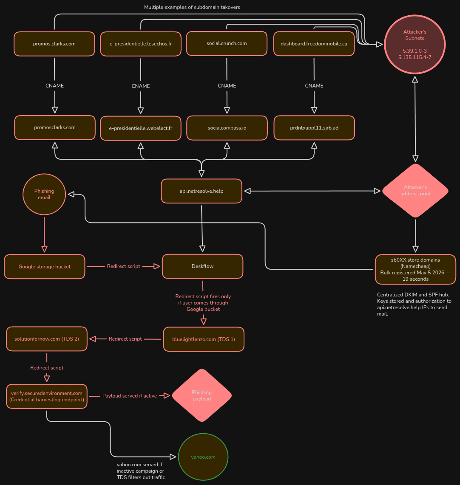

## Dangling CNAME Attacks

The attacker appears to have registered multiple decommissioned domains and exploited dangling CNAME records left by legitimate organizations, allowing attacker-controlled infrastructure to resolve through trusted brand subdomains. 

